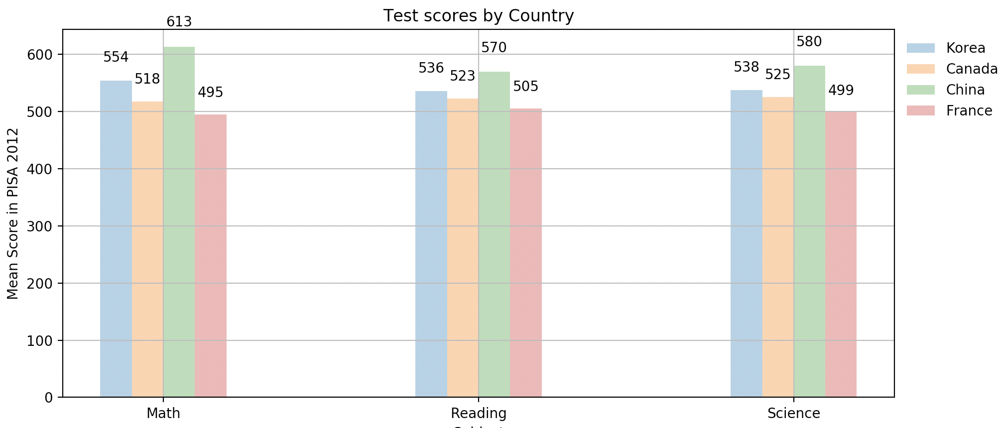

# Python Course

Repository with different applications using Python (12/2019)

## Basic Web Project

Simplest web page using Python.

## Calculator

Using Python and Qt5 to create a visual interface of a functional calculator

`python3 main.py`

## Data Visualization

Using python and matplotlib to display different types of charts.

## Django Project

Using Python and Django created a simple web page connected to a MongoDB.

## PyMongo

Introduction to PyMongo

## Web Project

Using Python and the library web to create a simple web page.

## Web Scraper

Using Python and beautifulSoup to scrap images. This script will ask you to enter the name of the thing you want to scrape and download a constant number of images of it.
